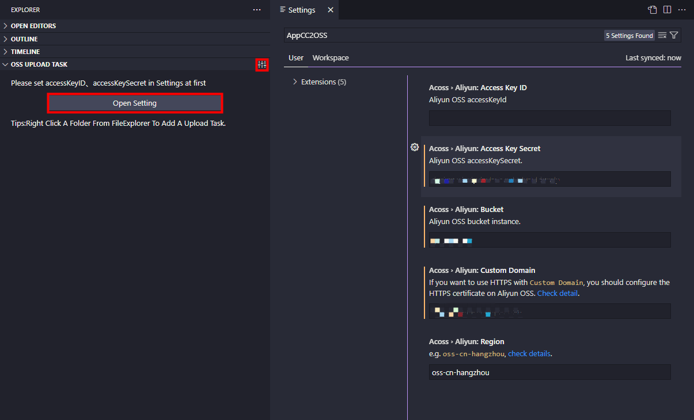

# appcc2oss 

一个oss上传任务插件，管理任务并执行上传任务的插件。

## 使用帮助

### 配置OSS参数
在Vscode的Explorer窗口中找到'OSS UPLOAD TASK'界面，点击右上角设置图标，设置必要的OSS参数。如下：

### 创建任务
右击工作空间中的需要上传到oss的文件夹，选择菜单'Oss: Add Upload Task'，并输入远程目录后回车即可。

### 执行任务（上传文件到OSS）
右击'OSS UPLOAD TASK'界面中的任意任务，选择'Upload'，开始上传。

### 删除任务
右击'OSS UPLOAD TASK'界面中的任意任务，选择'Delete'。

### 拷贝连接
右击'OSS UPLOAD TASK'界面中的任意任务，选择'Copy Link'。

## 1.0.0
完成基本功能

**Enjoy!**
